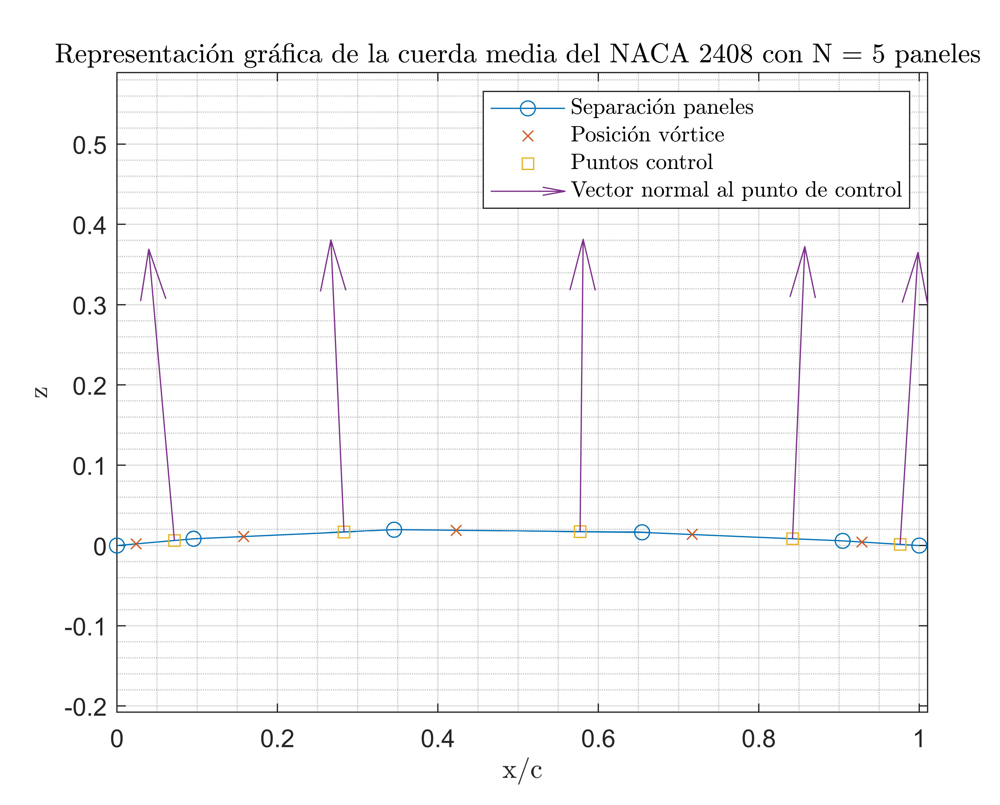
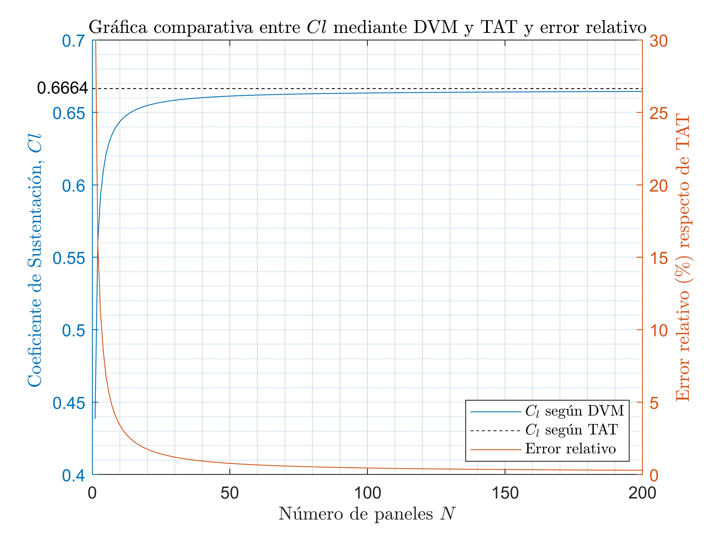
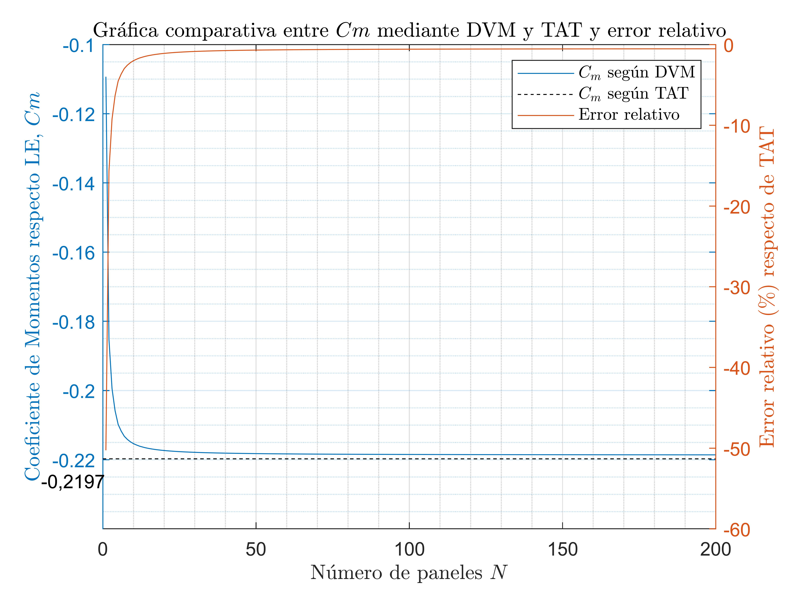

# DVM-4digit-NACA
Analysis And Computation Of Aerodynamics Parameters of a 4-digit NACA  Airfoil With Flaps Using The Discrete Vortex Method (DVM)

## Problem statement
It is requested to write a computer code to analyze NACA 4-digit airfoils with trailing edge flaps using the Discrete Vortex Method (DVM). The inputs of the computer program should be the airfoil designation, the angle of attack of analysis and the number of panels (N) along the camber line. In addition, the flap hinge location (xh) and deflection angle () are required for flap simulation. This will be done simply by modifying the coordinates of the airfoil’s camber line along the flap by rotation about its hinge.

With the input data described, the program should compute the lift coefficient (Cl) and the coefficient of moment about the leading edge (Cmle). Once your code runs properly carry out the following analyses: Verification and Validation.

Plotting Cl with DVM method and TAT and the relative error:

Plotting Cm with DVM method and TAT and the relative error:

